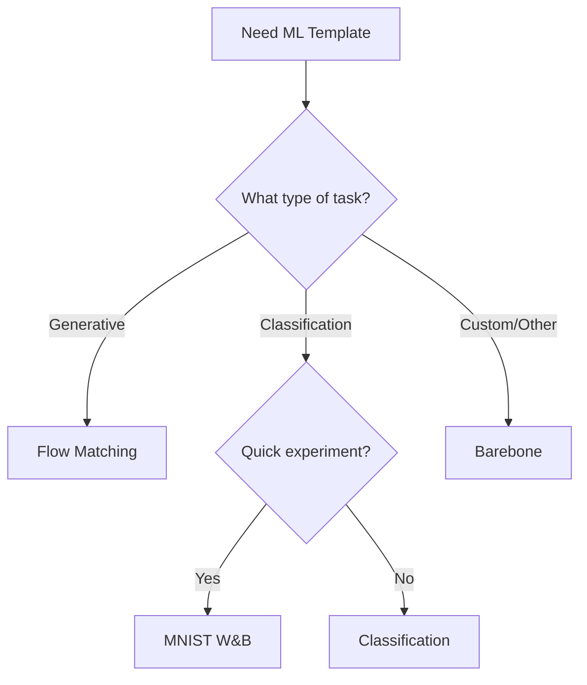

# Template Overview

Choose the right template for your machine learning project.

## Template Comparison

| Feature | Barebone | Flow Matching | MNIST W&B | Classification |
|---------|----------|---------------|-----------|----------------|
| **Status** | ✅ Stable | ✅ Stable | ✅ Stable | 🚧 Beta |
| **Complexity** | Minimal | Complete | Medium | Medium |
| **Best For** | Starting from scratch | Generative models | Quick experiments | Image classification |
| **Includes Model** | Basic example | Full implementation | CNN classifier | Configurable models |
| **W&B Integration** | Optional | Yes | Yes | Optional |
| **Documentation** | Full | Full | Full | Partial |
| **Tests** | ✅ | ✅ | ✅ | ⚠️ |

## Template Details

### Barebone Template

**Perfect for:** Custom projects where you want maximum control

```bash
cookiecutter gh:MoustHolmes/cookiecutter-ml-templates --directory=templates/barebone
```

**What's included:**

- ✅ Minimal project structure
- ✅ Hydra configuration setup
- ✅ PyTorch Lightning boilerplate
- ✅ Basic data module example
- ✅ Unit test framework
- ✅ Optional documentation structure
- ✅ Dual dependency manager support (pip/uv)

**Configuration options:**

- `project_structure`: Choose `full` (with docs) or `minimal` (no docs)
- `deps_manager`: Choose `pip` or `uv`

**Use cases:**

- Starting a new research project
- Custom architectures from scratch
- Educational purposes
- Prototyping

[Learn more →](barebone.md)

---

### Flow Matching Template

**Perfect for:** Generative modeling and flow-based models

```bash
cookiecutter gh:MoustHolmes/cookiecutter-ml-templates --directory=templates/flow_matching
```

**What's included:**

- ✅ Complete flow matching implementation
- ✅ Multiple schedulers (Linear, Cosine)
- ✅ Various samplers (Gaussian, Uniform)
- ✅ ODE solvers (Euler, RK4)
- ✅ Pre-configured experiments
- ✅ Comprehensive tests
- ✅ Example notebooks

**Key components:**

```python
# Schedulers
- LinearScheduler
- CosineScheduler

# Samplers
- GaussianSampler
- UniformSampler

# Solvers
- EulerSolver
- RK4Solver
```

**Use cases:**

- Continuous normalizing flows
- Diffusion models
- Generative modeling research
- Learning flow matching

[Learn more →](flow-matching.md)

---

### MNIST W&B Logger Template

**Perfect for:** Quick experiments with experiment tracking

```bash
cookiecutter gh:MoustHolmes/cookiecutter-ml-templates --directory=templates/MNIST_wandb_image_logger
```

**What's included:**

- ✅ MNIST dataset integration
- ✅ Weights & Biases logging
- ✅ Image logging callbacks
- ✅ Pre-configured CNN model
- ✅ Training visualization
- ✅ Quick experiment setup

**Features:**

- Automatic image logging during training
- Confusion matrix visualization
- Learning curve tracking
- Hyperparameter logging

**Use cases:**

- Teaching ML workflows
- Quick prototyping
- Experiment tracking demos
- Baseline comparisons

[Learn more →](mnist-wandb.md)

---

### Classification Template

**Perfect for:** Image classification tasks

```bash
cookiecutter gh:MoustHolmes/cookiecutter-ml-templates --directory=templates/classification
```

!!! warning "Beta Status"
    This template is currently in beta. Some features may be incomplete.

**What's included:**

- ⚠️ Configurable model architectures
- ⚠️ Data augmentation pipelines
- ⚠️ Transfer learning support
- ⚠️ Multi-class classification

**Use cases:**

- Custom image classification
- Transfer learning projects
- Fine-tuning pre-trained models

[Learn more →](classification.md)

---

## Choosing a Template

### Decision Flow



### By Experience Level

**Beginners:**

1. Start with **MNIST W&B** to understand the workflow
2. Move to **Barebone** for custom projects
3. Explore **Flow Matching** for advanced topics

**Intermediate:**

1. **Barebone** for most projects
2. **Flow Matching** for generative models
3. **Classification** for vision tasks

**Advanced:**

1. **Barebone** with heavy customization
2. **Flow Matching** as reference implementation
3. Create your own templates

### By Project Type

**Research:**

- **Barebone** - Maximum flexibility
- **Flow Matching** - Generative research

**Production:**

- **Barebone** - Clean slate for production code
- **Classification** - Standard vision pipelines

**Learning:**

- **MNIST W&B** - Understand ML workflow
- **Flow Matching** - Learn advanced concepts

## Common Features

All templates include:

- 🐍 **Python 3.10+** support
- ⚡ **PyTorch Lightning** integration
- 🔧 **Hydra** configuration
- 🧪 **Pytest** test suite
- 📝 **Documentation** ready
- 🎨 **Code formatting** (Ruff, Black)
- 🪝 **Pre-commit hooks**
- 📦 **Package structure**

## Migration Guide

### From Other Templates

#### From Lightning-Hydra-Template

Key differences:

- More opinionated structure
- Integrated testing from start
- Optional scaffolding (minimal mode)
- Dual dependency manager support

Migration steps:

1. Create new project with barebone template
2. Copy your model code to `src/your_project/`
3. Adapt configs to new structure
4. Update import paths

#### From Scratch

Benefits of using a template:

- Skip boilerplate setup
- Best practices included
- Tested structure
- Community patterns

## Next Steps

1. **[Quick Start](../getting-started/quickstart.md)** - Create your first project
2. **[Configuration Guide](../guides/hydra-config.md)** - Master Hydra configs
3. **[Testing Guide](../guides/testing.md)** - Write effective tests
4. **[Best Practices](../reference/best-practices.md)** - Level up your code
