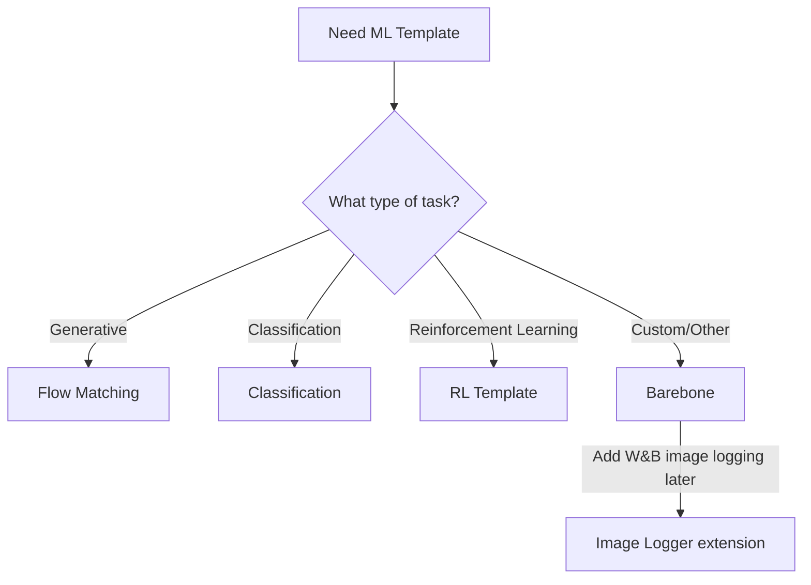

# Template Overview

Choose the right template for your machine learning project.

## Template Comparison

| Feature | Barebone | Flow Matching | Reinforcement Learning | Classification |
|---------|----------|---------------|------------------------|----------------|
| **Status** | ✅ Stable | ✅ Stable | ✅ Stable | 🚧 Beta |
| **Complexity** | Minimal | Complete | Complete | Medium |
| **Best For** | Starting from scratch | Generative models | RL research & baselines | Image classification |
| **Includes Model** | Basic example | Full implementation | SAC/TD3/PPO/RPO/DQN | Configurable models |
| **W&B Integration** | Optional | Yes | Yes | Optional |
| **Tests** | ✅ | ✅ | ✅ | ⚠️ |

## Template Details

### Barebone Template

**Perfect for:** Custom projects where you want maximum control

```bash
mkdir my_project && cd my_project
copier copy gh:MoustHolmes/cookiecutter-ml-templates/templates/barebone . --trust
```

**What's included:**

- Minimal project structure
- Hydra configuration setup
- PyTorch Lightning boilerplate
- Basic data module example
- Unit test framework
- Optional documentation structure (`project_structure=full`)
- pip, uv, and pixi support

**Configuration options:**

- `project_structure`: `full` (with docs) or `minimal`
- `deps_manager`: `pip`, `uv`, or `pixi`

**Use cases:**

- Starting a new research project
- Custom architectures from scratch
- Educational purposes
- Prototyping

[Learn more →](barebone.md)

---

### Flow Matching Template

**Perfect for:** Generative modeling and flow-based models

```bash
mkdir my_project && cd my_project
copier copy gh:MoustHolmes/cookiecutter-ml-templates/templates/generative/flow_matching . --trust
```

**What's included:**

- Complete flow matching implementation
- Multiple schedulers (Linear, Cosine)
- Various samplers (Gaussian, Uniform)
- ODE solvers (Euler, RK4)
- Pre-configured experiments
- Comprehensive tests
- Example notebooks

**Use cases:**

- Continuous normalizing flows
- Diffusion models
- Generative modeling research
- Learning flow matching

[Learn more →](flow-matching.md)

---

### Reinforcement Learning Template

**Perfect for:** RL research, algorithm benchmarking, and learning modern RL with clean code

```bash
mkdir my_project && cd my_project
copier copy gh:MoustHolmes/cookiecutter-ml-templates/templates/rl . --trust
```

**What's included:**

- SAC, TD3, PPO (discrete & continuous), RPO, DQN
- Gymnasium environment integration
- Hydra configs per algorithm and environment
- Pre-built experiment configs (pendulum, cartpole, lunar_lander)
- Replay buffer (off-policy) and rollout buffer (on-policy)
- Observation normalizer (RunningMeanStd)
- Episode reward / video logging callbacks
- W&B experiment tracking

**Supported algorithms:**

| Algorithm | Type | Action Space |
|-----------|------|-------------|
| SAC | Off-policy | Continuous |
| TD3 | Off-policy | Continuous |
| PPO | On-policy | Continuous & Discrete |
| RPO | On-policy | Continuous |
| DQN | Off-policy | Discrete |

**Use cases:**

- RL research and baselines
- Benchmarking algorithms on Gymnasium tasks
- Learning RL with structured, readable code
- Starting point for custom RL environments

[Learn more →](rl.md)

---

### Classification Template

**Perfect for:** Image classification tasks

```bash
mkdir my_project && cd my_project
copier copy gh:MoustHolmes/cookiecutter-ml-templates/templates/core/classification . --trust
```

!!! warning "Beta Status"
    This template is currently in beta. Some features may be incomplete.

**What's included:**

- Configurable model architectures
- Data augmentation pipelines
- Multi-class classification

**Use cases:**

- Custom image classification
- Transfer learning projects
- Fine-tuning pre-trained models

[Learn more →](classification.md)

---

### Image Logger Extension

**Perfect for:** Adding W&B image logging to an existing project

Extensions are applied to an already-generated project. Run from inside the project directory:

```bash
cd my_project
copier copy gh:MoustHolmes/cookiecutter-ml-templates/templates/extensions/image_logger . --trust
```

The extension reads your `.copier-answers.yml` to pick up `project_name`, `repo_name`, and `deps_manager` automatically, then adds `wandb` to your dependencies and scaffolds image logging callbacks.

[Learn more →](mnist-wandb.md)

---

## Choosing a Template

### Decision Flow


```mermaid
graph TD
    A[Need ML Template] --> B{What type of task?}
    B -->|Generative| C[Flow Matching]
    B -->|Classification| D[Classification]
    B -->|Reinforcement Learning| E[RL Template]
    B -->|Custom/Other| F[Barebone]
    F -->|Add W&B image logging later| G[Image Logger extension]
```

### By Experience Level

**Beginners:**

1. Start with **Barebone** to understand the structure
2. Add the **Image Logger** extension for W&B experiment tracking
3. Explore **Flow Matching** for advanced topics

**Intermediate:**

1. **Barebone** for most projects
2. **Flow Matching** for generative models
3. **RL Template** for reinforcement learning
4. **Classification** for vision tasks

**Advanced:**

1. **Barebone** with heavy customization
2. **Flow Matching** or **RL Template** as reference implementations
3. Create your own templates

### By Project Type

**Research:**

- **Barebone** — maximum flexibility
- **Flow Matching** — generative research
- **RL Template** — RL algorithm research and baselines

**Production:**

- **Barebone** — clean slate for production code
- **Classification** — standard vision pipelines
- **RL Template** — structured RL pipelines

**Learning:**

- **Barebone** — understand the project layout
- **Flow Matching** — learn generative modeling
- **RL Template** — learn RL with clean, readable code

## Common Features

All templates include:

- Python 3.10–3.13 support
- PyTorch Lightning integration
- Hydra configuration
- Pytest test suite
- Documentation-ready structure
- Code formatting (Ruff)
- Pre-commit hooks
- Package structure (`src/` layout)
- `copier update` support

## Next Steps

1. **[Quick Start](../getting-started/quickstart.md)** — create your first project
2. **[Configuration Guide](../guides/hydra-config.md)** — master Hydra configs
3. **[Testing Guide](../guides/testing.md)** — write effective tests
4. **[Best Practices](../reference/best-practices.md)** — level up your code
